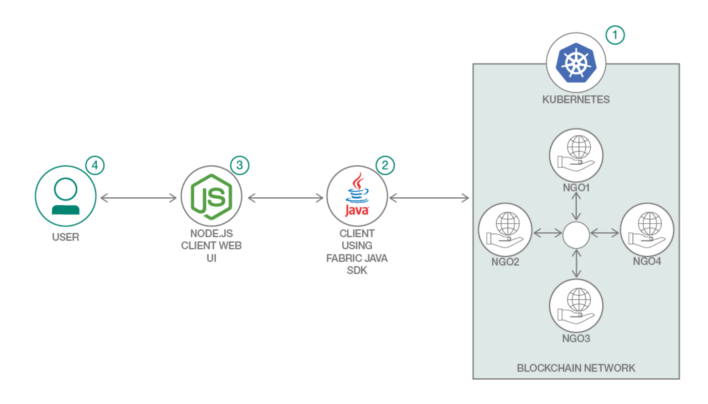
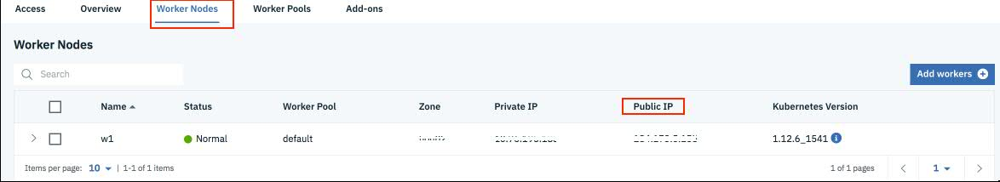
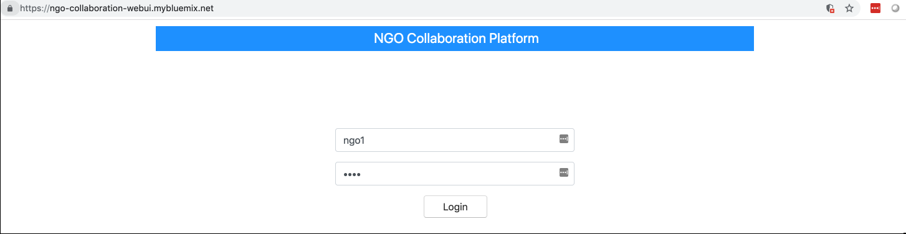
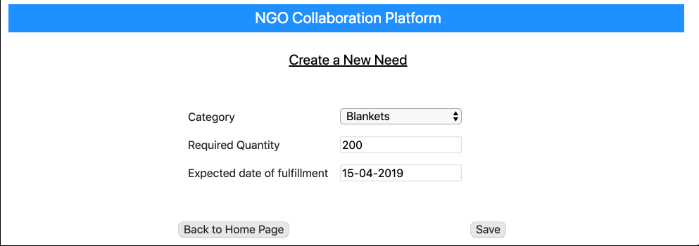
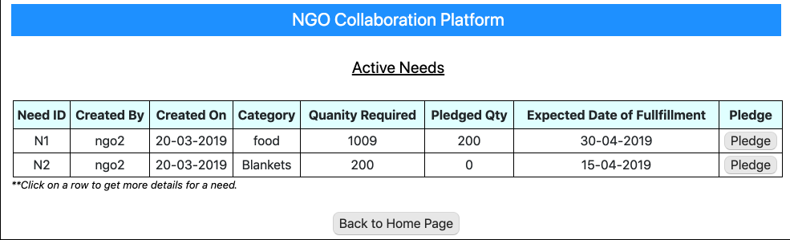
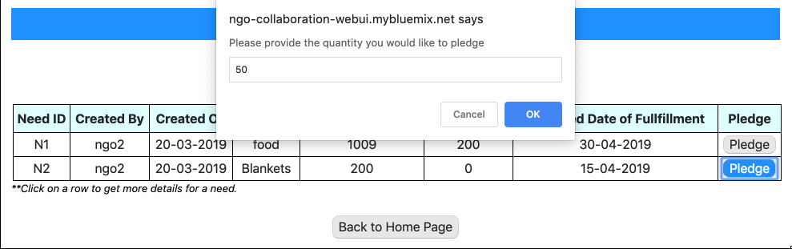
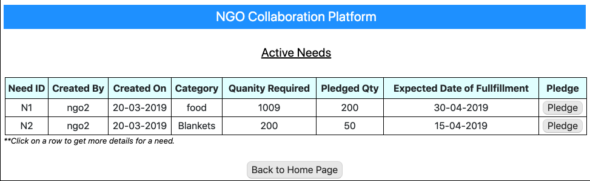
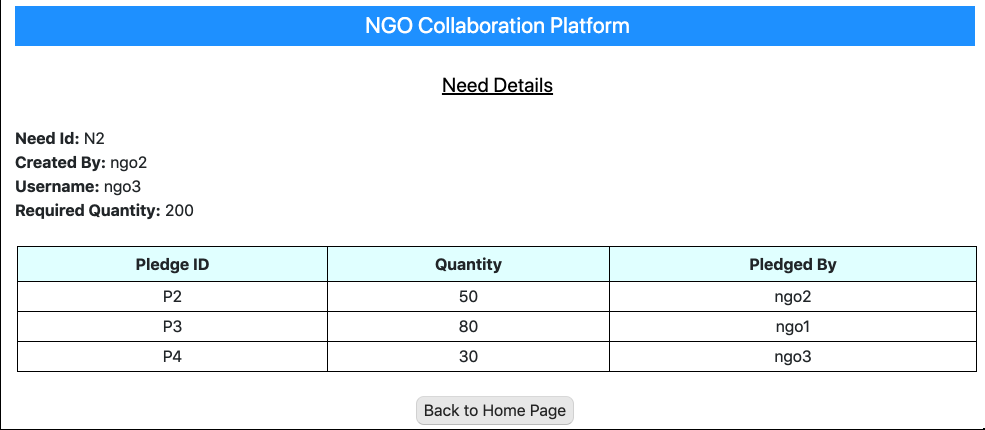
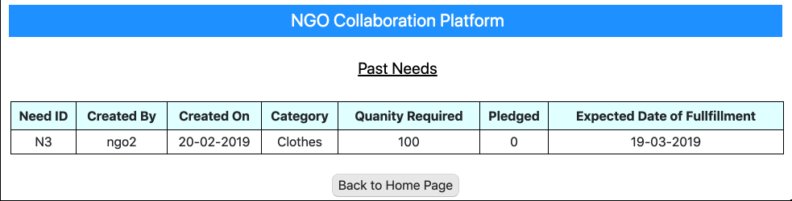

# Facilitate collaboration between non-governmental organizations using blockchain

### Use Hyperledger Fabric to manage supply and demand of goods to be distributed to the needy

NGO is a non-profit organization that operates independently of any government and is a social voluntary organization of social activist, group of persons, community, volunteers and citizens who are associated for social welfare and social development. NGOs are usually funded by donations, but some avoid formal funding altogether and are run primarily by volunteers. Every NGO has its own mission and objectives.

When there is a person/organization in need, they approach NGO for help. But all the times, the requirement cannot be fulfilled by any one NGO or sometimes end user does not know which NGO to reach out for a specific requirement. In such hard times, NGOs should avoid competition and compromise and instead co-operate to achieve better results. But misunderstandings and collaboration without trust can prevent partnerships from reaching their potential.

Hence here is a blockchain based solution for NGO collaboration, in which NGOs with a diverse/same portfolios can come forward and be a part of consortium. When one approaches an NGO with some need (say books for education), that NGO can not help for this need or it can not be fulfilled by that NGO alone, then that NGO will create a new request in the network. All other NGOs whoever can contribute will update the request over the blockchain network. This network will give the holistic view of the requirement and its current status. This way a need is catered to in an efficient manner. The problems of over collection or under collection for a need is reduced. The platform brings in trust, accountability and transparency of operations between NGOs.

This composite pattern demonstrates a solution using a combination of other individual code patterns.
- [Deploy Hyperledger Fabric network on IBM Cloud](https://github.com/IBM/blockchain-network-on-kubernetes)
- [Create and deploy a blockchain network using Hyperledger Fabric SDK for Java](https://github.com/IBM/blockchain-application-using-fabric-java-sdk)

When the reader has completed this Code Pattern, they will understand how to:

- Setup blockchain Network on Kubernetes directly through configuration files not using [Blockchain Platform 2.0]((https://cloud.ibm.com/catalog/services/blockchain-platform-20)) as a service on IBM Cloud
- Interact with blockchain network using Fabric Java SDK
- Build a client application which will interact with blockchain network with the help of SDK

# Flow



1. Setup Blockchain Network using Kubernetes configuration files on IBM Cloud.
2. Deploy the client application using Fabric Java SDK. It works as middle layer and exposes REST API.
3. Deploy Web UI application built using NodeJs.
4. User can perform following task using the web interface which internally interacts with Blockchain Network with the help of middle layer.
   * Create a new need
   * Pledge for a need
   * View needs


# Pre-requisites

* [IBM Cloud Account](https://cloud.ibm.com)
* [Git Client](https://git-scm.com/downloads) - needed for clone commands.
* [Maven](https://maven.apache.org/install.html)
* [Nodejs](https://nodejs.org/en/download/)

# Steps

Follow these steps to setup and run this code pattern. The steps are described in detail below.

1. [Get the code](#1-get-the-code)
2. [Deploy Hyperledger Fabric Network using Kubernetes on IBM Cloud](#2-deploy-hyperledger-fabric-network-using-kubernetes-on-ibm-cloud)
3. [Build the client application based on Fabric Java SDK](#3-build-the-client-application-based-on-fabric-java-sdk)
4. [Build and deploy webapp](#4-build-and-deploy-webapp)
5. [Analyze the Results](#5-analyze-the-results)

## 1. Get the code

- Clone the repo using the below command.
   ```
   git clone https://github.com/IBM/ngo-collaboration-using-blockchain
   ```

 - In this repository, 
    * [Network setup](https://github.com/IBM/ngo-collaboration-using-blockchain/tree/master/blockchain-network-on-kubernetes): configuration files and scripts to deploy Hyperledger Fabric network using Kubernetes on IBM Cloud.
    * [Client code using Fabric Java SDK](https://github.com/IBM/ngo-collaboration-using-blockchain/tree/master/fabric-java-sdk-app): application code built using Fabric Java SDK to invoke and query chaincode on the hyperledger fabric network. The operations are exposed as ReST APIs when deployed enabling other applications to consume.
    * [Web application code](https://github.com/IBM/ngo-collaboration-using-blockchain/tree/master/webapp): NodeJS based application code to render UI and integrates with the ReST APIs exposed by the client application built on Fabric Java SDK.
    
    
## 2. Deploy Hyperledger Fabric Network using Kubernetes on IBM Cloud

In this step, we will setup the Hyperledger Fabric network using Kubernetes. For detailed steps, please refer to the [Deploy blockchain network on Cloud](https://github.com/IBM/blockchain-network-on-kubernetes).

The scripts and configuration files to setup the network for this pattern can be located at `blockchain-network-on-kubernetes`. Perform the following steps to setup the network.

* Create a [Kubernetes Service](https://cloud.ibm.com/kubernetes/catalog/cluster?bss_account=01fedb4f3ff70b186d83cdb1e1e0cbc8) instance using IBM Cloud dashboard.
* Gain access of your Kubernetes cluster as explained in `step 3` in [repository](https://github.com/IBM/blockchain-network-on-kubernetes) and ensure you are able to run `kubectl` commands properly.
* In case of IKS 1.11.x or greater, modify the `blockchain-network-on-kubernetes/configFiles/peersDeployment.yaml` file to point to a Docker service. Change instances of `unix:///host/var/run/docker.sock` to `tcp://docker:2375` with a text editor or use the commands below.
   ```
   ## macOS
   $ sed -i '' s#unix:///host/var/run/docker.sock#tcp://docker:2375# configFiles/peersDeployment.yaml

   ## Linux
   $ sed -i s#unix:///host/var/run/docker.sock#tcp://docker:2375# configFiles/peersDeployment.yaml
   ```
  
* Choose the appropriate script to setup the network as per your environment. For this, check your kubectl CLI version as:

    ```
    $ kubectl version --short
    ```

  This command will give you `Client Version` and `Server Version`. 
  If the `Client version > v1.11.x` i.e. 1.12.x or more then use `setup_blockchainNetwork_v2.sh` to set up the network. Run 
  the following command:

    ```
    cd blockchain-network-on-kubernetes
    cp setup_blockchainNetwork_v2.sh setup_blockchainNetwork.sh
    ```

  If the `Client version <= v1.11.x` then use `setup_blockchainNetwork_v1.sh` to setup the network. Copy the script as shown.
    ```
    cd blockchain-network-on-kubernetes
    cp setup_blockchainNetwork_v1.sh setup_blockchainNetwork.sh
    ```


* Execute the following steps to setup the network.
   ```
   cd blockchain-network-on-kubernetes
   chmod +x setup_blockchainNetwork.sh
   ./setup_blockchainNetwork.sh
   ```
* If there is a need to delete the network, execute the following steps.
   ```
   $ chmod +x deleteNetwork.sh
   $ ./deleteNetwork.sh
   ```

**Get the public IP of your Kubernetes Cluster**

After setting up your network, find out the public IP of your cluster. It will be required for further steps.

* Go to IBM Cloud Dashboard.

* Click on your Kubernetes Cluster under `Clusters` section on Dashboard. It gives you details of the cluster.

* Access `Worker Nodes` tab, it will show you the public IP of your cluster as shown in below screenshot.

  
  
  Make a note of this public IP. It will be used in next step.
  

## 3. Build the client application based on Fabric Java SDK

Here, we use the [Fabric Java SDK](https://github.com/hyperledger/fabric-sdk-java) to build a client to invoke and query chaincode on the hyperledger fabric network.

The first step is to specify the public IP address of the Kubernetes Cluster. The public IP address can be found on the `Kubernetes Dashboard` as described in the previous section.

Open the `manifest.yml` file under `fabric-java-sdk-app` directory. Enter the public IP address of the Kubernetes Cluster for the variable `KUBERNETES_IP_ADDRESS`, and save the file.

```
applications:
  - name: ngo-collaboration-java-app
    random-route: true
    memory: 256M
    path: target/ngo-collaboration-java.war
    buildpack: liberty-for-java
    env:
      KUBERNETES_IP_ADDRESS: xxx.xxx.xx.xx
```

Next, on the command terminal go to `ngo-collaboration-using-blockchain` directory, and execute the below commands:
```
cd fabric-java-sdk-app
mvn clean install
ibmcloud cf push
```
Login to `IBM Cloud`. On the `Dashboard`, verify that an app `ngo-collaboration-java-app` is running fine.

Make a note of this Fabric Java SDK client application's url. On IBM Cloud dashboard, click on the application. When application page opens, click on `Visit App URL`. Now make a note of the url, as shown on the browser, even if the page shows some error. If the url ends with a `/` then remove the trailing forward slash. This url should be provided in web application that interacts with this Fabric Java SDK client application. 

## 4. Build and deploy webapp

A web application is provided to perform various operations like `View Needs`, `Create Need`, `Pledge for a need` etc. Web appication code can be found under `webapp` directory.

This web application invokes rest interfaces implemented in Fabric Java SDK client application as explained above. Hence the web application needs Fabric Java SDK client application url for rest invocations.

Perform the following steps:

- Update the Java application url, as noted in section [Build the client application based on Fabric Java SDK](#3-build-the-client-application-based-on-fabric-java-sdk) in `config.js` file, found in the root folder of web application.

- On command prompt navigate to web application root folder. Run the command 
  ```
  npm install
  ```
  This installs all the necessary libraries.

- Next you will deploy the web application to IBM Cloud. Deploy the application to IBM Cloud using the command 
  ```
  ibmcloud cf push
  ```
  Deployment might take a few minutes to complete. Ensure that there are no errors while deploying the application. 


## 5. Analyze the Results

Login to `IBM Cloud`. On the `Dashboard`, verify that an app `ngo-collaboration-webui` is running fine. Click on the web application entry. When application page opens, click on `Visit App URL`. Web application login page opens.

Login usernames are `ngo1`, `ngo2`, `ngo3`, `ngo4`. Passwords are same as usernames. Login to the application using any login details. 



You will be presented with the tasks that you can perform.


There are no needs available by default. So create one or more new needs. To create a new need click on `Create a New Need`. Enter need details. Note that the date format is always `dd-mm-yyyy`.



Click on `Save` button to create need. A pop up message appears with the result of the create need request. Click `OK`. You can create more needs. Suggest you to create needs by logging in with different users so as to simulate a real scenario. Once done click on `Back to Home Page` button to return to tasks list.

Click on `View Active Needs` to view the list of active needs, as shown in below image. Note that a need was already created while taking the below screen capture. For you there should be only one need listed for the first time you create a need.



Click on `Pledge` button to pledge a certian quantity of the need that was created. A pop up dialog asks for the quantity you want to pledge. Enter some quantity that is less than or equal to the remaining quantity for the need.



> Note: There are no validation done for the values entered. So, enter values that make sense.

Click `OK`. You should get an alert message about the result of the pledge operation. Click `OK`. To refresh the data, click `Back to Home Page` and then again click `View Active Needs`. The pledged data should be updated.



Similarly add a couple of more pledges, but login using different usernames for every pledge to simulate real scenario. After few more pledges are made, go to home page (dashboard) and click on `View Active Needs`. Click on the row of the need for which pledges were made. You should see details as shown in below image.



Click `Back to Home Page` to go back to dashboard. 

`View Past Needs` shows all the needs whose `Expected Date of Fullfillment` is a past date as on current date. For us to have past needs, in the backend we added a need with a past date just to show the functionality here. You will have to wait till the date after the expected date of fullfill is over. Then click on `View Past Needs`.



We saw that needs can be created by different NGOs which is visible to all the NGOs in the network. Any NGO can pledge for the need which is captured in the network and whose details can also be viewed. NGOs can see past needs and their details as well.


# Troubleshooting
See [Debugging.md](./Debugging.md)


# Learn More

- [Track donations with Blockchain](https://developer.ibm.com/patterns/track-donations-blockchain/)
- [Why NGOs need collaboration?](https://www.theguardian.com/global-development/poverty-matters/2012/mar/13/ngos-need-third-way-collaboration)
- [Understand Business-NGO partnerships](https://blogs.worldbank.org/publicsphere/why-collaborate-three-frameworks-understand-business-ngo-partnerships)

<!-- keep this -->
## License

This code pattern is licensed under the Apache Software License, Version 2. Separate third-party code objects invoked within this code pattern are licensed by their respective providers pursuant to their own separate licenses. Contributions are subject to the [Developer Certificate of Origin, Version 1.1 (DCO)](https://developercertificate.org/) and the [Apache Software License, Version 2](https://www.apache.org/licenses/LICENSE-2.0.txt).

[Apache Software License (ASL) FAQ](https://www.apache.org/foundation/license-faq.html#WhatDoesItMEAN)
